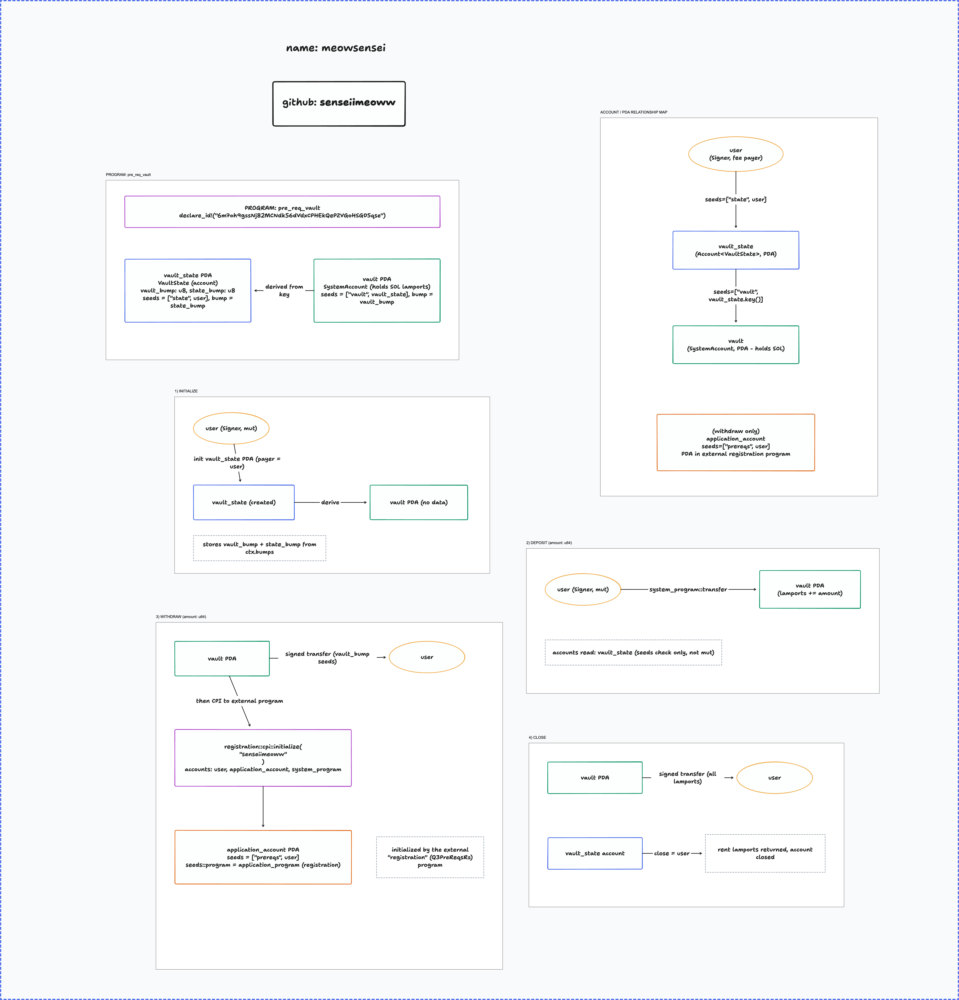

# Vault Program: Turbin3 Prereq Challenge

A simple Solana vault program built with **Anchor**. Each user gets their own vault to deposit, withdraw, and manage SOL.

📺 Video walkthrough: [Video](https://youtu.be/x4lDC-i661I)

---

## Overview

This program acts as a personal vault for SOL. It supports four actions:

1. **Initialize** - set up a new vault
2. **Deposit** - add SOL to the vault
3. **Withdraw** - remove SOL from the vault (with proof of completion)
4. **Close** - shut down the vault and reclaim funds

Each user has exactly **one vault**, and the vault's address is deterministic — the same user wallet always derives the same vault address.

---

## Accounts

Each user's vault is made up of two accounts:

| Account                 | Purpose                                                                                      |
| ----------------------- | -------------------------------------------------------------------------------------------- |
| **Vault State Account** | Stores minimal data, specifically the bump seeds used to confirm/derive the vault's address. |
| **Vault Account**       | Holds the actual SOL balance.                                                                |

Both account addresses are derived (PDA-style) from the user's wallet, so a given user always gets the same vault addresses.

---

## Actions

### 1. Initialize

- Triggered by the user.
- Creates the vault state account.
- Links the vault state account to the vault account.
- The user pays the rent/creation cost.
- Once complete, the user can begin depositing funds.

### 2. Deposit

- The user sends SOL into the vault account.
- The program simply moves the funds - no additional logic.

### 3. Withdraw

- The vault account sends SOL back to the user.
- Since the vault account is a **program-owned account** (not a normal wallet), it signs the transaction itself using its **bump seed**.
- After the transfer completes, the program performs a **Cross-Program Invocation (CPI)** to a second program, the **registration program**.
- The registration program records the withdrawal as a **proof of completion**.

### 4. Close

- The user can close their vault at any time.
- All remaining SOL is sent back to the user.
- The vault state account is deleted.
- The rent paid during initialization is refunded to the user.

---

## Summary

- Each user has **one vault**.
- The vault supports **four actions**: open the vault, add funds, remove funds (with proof), and close the vault.
- Withdrawals are signed by the vault itself using bump seeds and are recorded via CPI to a separate registration program for proof of completion.
